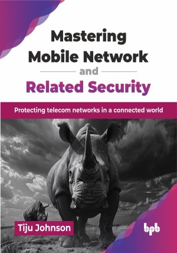

# Mastering Mobile Network and Related Security

Protecting telecom networks in a connected world.

This is the repository for [Mastering Mobile Network and Related Security
](https://bpbonline.com/products/mastering-mobile-network-and-related-security?variant=44672721027272),published by BPB Publications.

## About the Book
In an era where telecommunication networks form the backbone of our digital society, this book provides a definitive resource for understanding and implementing robust security measures across various generations of telecom infrastructure. From the fundamental security challenges of 1G networks to the complex threat landscape of 5G, this book delivers a thorough examination of vulnerabilities, attack vectors, and defense strategies that every telecom professional must understand.

This book systematically covers the entire mobile security spectrum. Drawing on real-world implementations and architectures, this guide bridges the gap between theoretical security concepts and practical deployment. Each chapter combines technical depth with actionable insights, featuring designs that demonstrate how service providers have successfully implemented defense-in-depth approaches across 3G, 4G, IMS, virtualized environments, RAN, transport, multi-access edge computing (MEC) infrastructures, and other telecom components.

Whether you are a security specialist seeking telecom-specific expertise, an engineer responsible for secure network design, an executive making strategic security investments or a student preparing for a career in telecommunications, this book provides the knowledge you need to protect critical telecom infrastructure. The included frameworks, checklists, and reference architectures serve as practical tools that can be applied to strengthen your organization's security posture in today's rapidly evolving threat landscape. 

## What You Will Learn
• Understand various telecommunication architectures across all telecom generations.

• Identify and mitigate security threats and vulnerabilities across all telecom generations.

• Implement defense strategies for critical telecommunications network infrastructure.

• Analyze and respond to sophisticated attacks targeting telecommunications assets.

• Transform security concepts into solutions using field-tested architectural patterns.

• Develop comprehensive security governance frameworks for telecom environments.

• Implement global security standards (3GPP, ETSI) for mobile network compliance.
